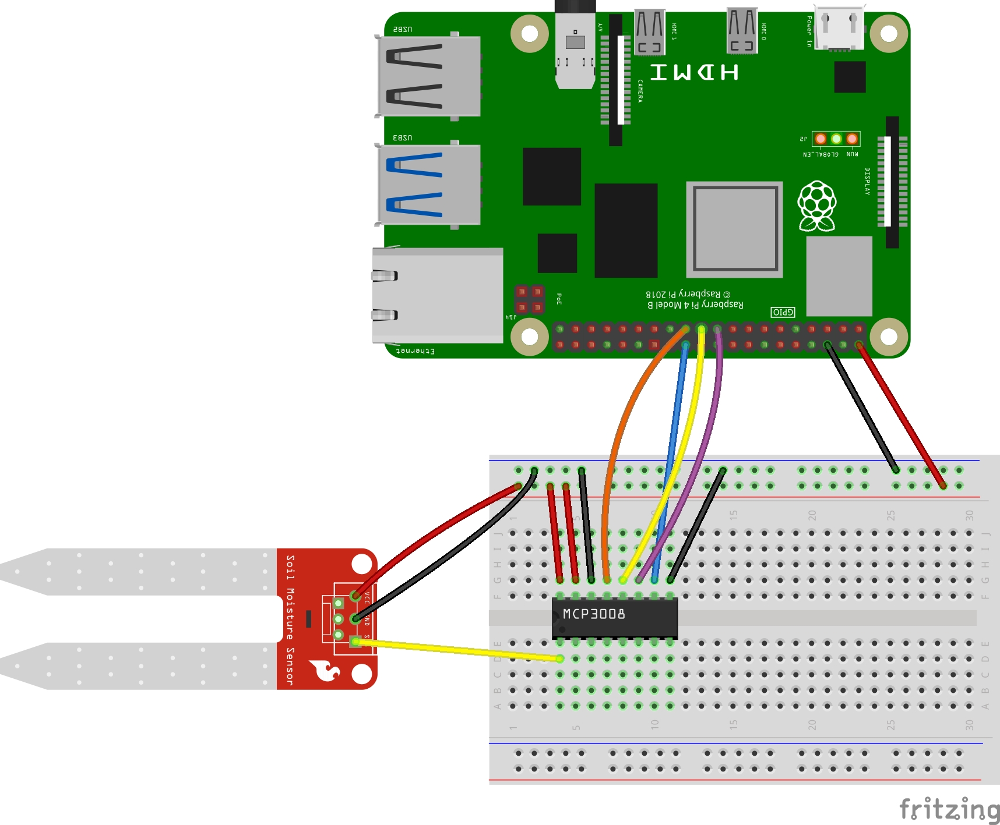

# Soil Moisture Sensor

- [Products](#products)
- [Wiring](#wiring)
- [Setup](#setup)
- [Usage](#usage)

## Products

- [Sparkfun Soil Moistur Sensor](https://www.amazon.com/gp/product/B074TN6VXW/ref=ppx_yo_dt_b_search_asin_title?ie=UTF8&psc=1)
- [MCP3008 A/D Converter](https://www.amazon.com/Bridgold-MCP3008-I-8-Channel-Converters-Interface/dp/B0C5774W5S/ref=sr_1_1?crid=2TGW5940Z0B5R&keywords=MCP3008&qid=1704185783&s=electronics&sprefix=mcp3008%2Celectronics%2C182&sr=1-1)

## Wiring

| MCP3008 | Raspberry Pi |
| ------- | ------------ |
| VDD     | 5V           |
| VREF    | 5V           |
| AGND    | GND          |
| DGND    | GND          |
| CLK     | SCLK         |
| DOUT    | MISO         |
| DIN     | MOSI         |
| CS/SHDN | CE0          |

Then conect the sensor's `SIG` terminal to `A0` on the MCP3008.



## Setup

Ensure SPI is enabled:

```bash
sudo raspi-config
# select "Interface Options" -> "SPI" -> "Yes"

sudo nano /boot/config.txt
# uncomment `dtparam=spi=on`

sudo reboot
```

Install kernal dependencies:

```bash
sudo apt-get update -y
sudo apt-get updgrade -y
sudo apt-get install build-essential python-dev python-smbus -y
python3 -m pip install gpiozero lgpio RPi.GPIO pigpio spidev
```

## Usage

```bash
python3 ./soil_moisture.py
```
