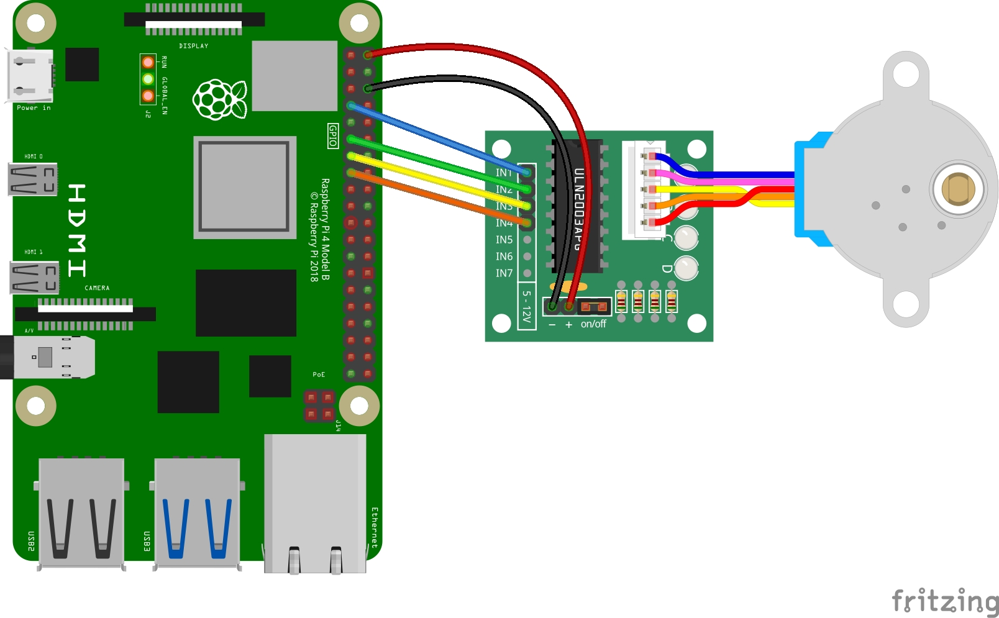

# 28BYJ-48 Stepper Motor

- [Products](#products)
- [Wiring](#wiring)
- [Setup](#setup)
- [Usage](#usage)
- [Resources](#resources)

## Products

- 28BYJ-48 Stepper Motor
- ULN2003 Driver

## Wiring

| ULN2003 | BCM    | Pin |
| ------- | ------ | --- |
| In1     | GPIO4  | 7   |
| In2     | GPIO17 | 11  |
| In3     | GPIO27 | 13  |
| In4     | GPIO22 | 15  |
| +       | 5V     | 2   |
| -       | GND    | 6   |



## Setup

Install dependencies:

```bash
python3 -m pip RPi.GPIO
```

## Usage

```bash
python3 ./stepper_motor.py
```

## Resources

- [Driving a 28BYJ-48 Stepper Motor & ULN2003 driver with a Raspberry Pi](https://ben.akrin.com/driving-a-28byj-48-stepper-motor-uln2003-driver-with-a-raspberry-pi/)
- [Controlling Stepper Motors using Python with a Raspberry Pi](https://keithweaverca.medium.com/controlling-stepper-motors-using-python-with-a-raspberry-pi-b3fbd482f886)
