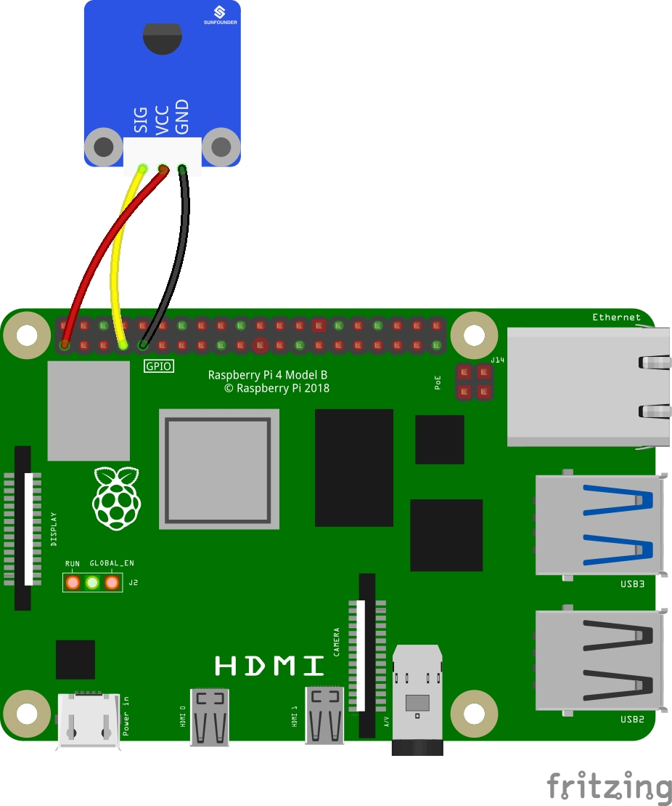

# DS18B20 Digital Temperature Sensor

- [Products](#products)
- [Wiring](#wiring)
- [Setup](#setup)
- [Usage](#usage)

## Products

- [DS18B20 Digital Temperature Sensor](https://www.amazon.com/Temperature-Waterproof-Stainless-Compatible-Raspberry/dp/B0924NBNZP/ref=sr_1_3?crid=15L5GV35A5GO2&keywords=DS18B20&qid=1704180945&sprefix=%2Caps%2C183&sr=8-3)

## Wiring

| DS18B20 | Raspberry Pi |
| ------- | ------------ |
| SIG     | GPIO4        |
| VCC     | 3v3          |
| GND     | GND          |



## Setup

Upgrade kernal:

```bash
sudo apt-get update
sudo apt-get updgrade -y
```

Edit `/boot/config.txt`:

```bash
sudo nano /boot/config.txt

# add this at the end of the file
dtoverlay = w1-gpio
```

Reboot the Pi:

```bash
sudo reboot
```

Mount devices drivers and validate everything installed correctly:

```bash
sudo modprobe w1-gpio
sudo modprobe w1-therm
ls /sys/bus/w1/devices/
```

If installed correctly, you should see a directory named `28-00000XXXXXXX`. That directory will be your sensor address.

## Usage

```bash
python3 ./temperature.py
```
